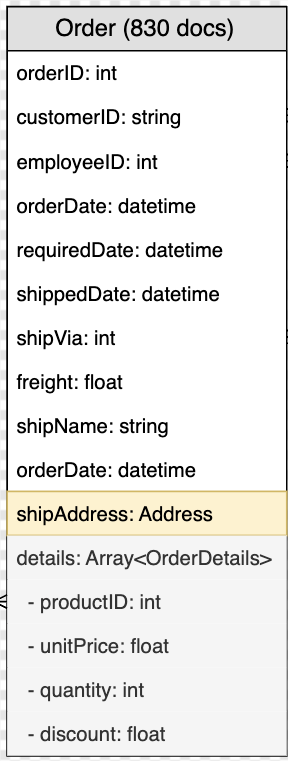

### SQLQRUNN

### 1. Overview

The SQLQ RUNN system is a web-based tool designed to allow users to run predefined, custom queries and  generate queries on CSV-based datasets (like we have orders dataset which have ordersId, customerID, shipCountry, shipCity, etc). It provides features such as a query selector, query editor, query history, query generator, search and sorting within results, pagination, and data export. The system supports real-time query execution and filtering on a sample dataset loaded from a CSV file.

### 2. Data
The Orders dataset used in this application are sourced from the Northwind dataset available at:
[Northwind CSV Data](https://github.com/graphql-compose/graphql-compose-examples/tree/master/examples/northwind/data/csv)

### 3. Page Load Time

Measured Load Time: 0.33s

Measurement Tool: Page Load Time Chrome Extension

### 4. Entity-Relationship (ER) Diagram

The orders table stores order details.

### 5. Tech Stack

Frontend: React.js, JavaScript, HTML, CSS

State Management: React Hooks (useState, useEffect)

Data Handling: PapaParse (CSV Parsing)

Export Feature: FileSaver.js

Future Enhancements: Backend integration with Node.js and SQL database

### 6. Features Implemented

Predefined Queries(Query Selector): Run common SQL queries with a single click.

Custom Query Execution(Query Editor): Users can input and execute their own SQL queries.

Query History: Stores the last five executed queries.

Sorting and Filtering: Users can sort and filter results using SQL ORDER BY and WHERE clauses.

Aggregation Functions: Supports COUNT, SUM, AVG, MIN, and MAX functions.

Pagination: Displays results in a paginated manner.

CSV Parsing: Fetches data from CSV files.

Export to CSV: Users can download query results.

Query Generator: Provides a UI for query construction.

### 7. How the Application Works

Data Loading: Orders and Customers data are loaded from CSV files using PapaParse.

Query Execution: Users can select predefined queries or enter custom SQL-like queries.

Filtering & Sorting: The application parses WHERE, ORDER BY, and GROUP BY clauses.

Aggregation: Functions like SUM, COUNT, AVG, etc., are processed.

Results Display & Export: Results are displayed in a table format with pagination and an option to export as CSV.

### 8. Query Execution Flow

The user selects or enters a query.

The application determines which dataset (orders/customers) to use.

The query is parsed to extract conditions, sorting, grouping, and aggregation operations.

The results are generated and displayed.

Users can download the result as a CSV file.

### 9. Application UI Layout

Navigation Bar (Select predefined queries, input custom queries)

Query Input Section (Text area for query entry, Run button)

Query Results Table (Displays executed query results with pagination)

Export Button (Download query results as CSV)

Query History Panel (Shows last executed queries)

Query Builder Modal (Helps users construct queries visually)

### 11. Sample Queries and Execution

SELECT * FROM orders;
SELECT * FROM orders WHERE shipCountry = 'France';

### 12. Installation & Setup

1. Clone the repository:

### git clone https://github.com/Himanshid914/SQLQ-RUNN-HERE.git
### cd query-runner-application

1. Install dependencies:

### npm install

3. Start the development server:

### npm start

Open http://localhost:3000 in the browser.
